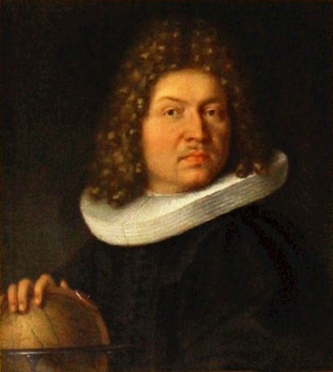

class: middle, left 
background-image:url('fig/1_stone.jpg')
background-position: 74% 100%
background-size: 170%


```{r setup, include=FALSE}
library(knitr)
options(htmltools.dir.version = FALSE)
opts_chunk$set(
  warning = FALSE,
  message = FALSE,
  echo = FALSE,
  cache.path = 'cache/',
  fig.align = 'center',
  cache = TRUE
)

library(tidyverse)
library(patchwork)
library(palmerpenguins)

```


```{css, echo=FALSE}
/* custom.css */
.left-code {
  color: #777;
  width: 70%;
  height: 92%;
  float: left;
}
.right-plot {
  width: 30%;
  float: right;
  padding-left: 1%;
}
.plot-callout {
  height: 225px;
  width: 450px;
  bottom: 5%;
  right: 5%;
  position: absolute;
  padding: 0px;
  z-index: 100;
}
.plot-callout img {
  width: 100%;
  border: 4px solid #23373B;
}
```


```{r xaringan-themer, include=FALSE, warning=FALSE}
library(xaringanthemer)
style_mono_accent(
   base_color = "#540317",
   title_slide_background_color = "#540317",
  inverse_background_color = "#540317",
  header_font_google = google_font("Josefin Sans"),
  text_font_google   = google_font("Montserrat", "300", "300i"),
  code_font_google   = google_font("Fira Mono"),
  title_slide_text_color = "#f5e9ec",
  inverse_header_color = "#2af7d9",
  header_background_text_color = "#deced2",
   text_font_size = "1.4rem",
  inverse_text_color = "#f5e9ec"
  )
```


**Dr. Priyanga D. Talagala**

#### <span style="color:#040a47">PhD in Statistics, Monash University, Australia</span>

--

#### <span style="color:#040a47">Senior Lecturer, Department of Computational Mathematics, University of Moratuwa </span>

--

#### <span style="color:#040a47">Associate Investigator of the Australian Research </br> Council Centre of Excellence for Mathematical </br> and Statistical Frontiers (ACEMS), Australia</span>

--

#### <span style="color:#040a47">Associate Editor, The R Journal (SJR ranking Q1)</span>

--


#### <span style="color:#040a47">BSc (Hons) Special Degree  in Statistics, USJ - Batch first </br> Gold Medalist, 2012</span>

--

# <span style="color:#000000">Devi Balika Vidyalaya 2000 - 2007</span>

---
class: top, left, inverse
background-image:url('fig/stat.png')
background-position: 50% 10%
background-size: 90%


<!-- 

All my lecturer

Organizers
-->
---
class: middle, center

# What is Artificial intelligence (AI)? 

--

## <span style="color:black"> AI is technology that enables computers and </span> <span style="color:blue">machines to simulate human intelligence</span>,<span style="color:black">  such as speech recognition, decision-making, pattern identification, and problem-solving abilities.</span>

<!--AI enables machines to mimic human intelligence.-->
---

class: top, left, inverse
background-image:url('fig/dog.png')
background-position: 50% 80%
background-size: 100%

.pull-left[

### Chihuahua and muffin
].pull-right[

### Labradoodle and fried chicken
]

---

class: middle, center

# What is Human intelligence? 

--


### <span style="color:black">multifaceted ability to learn, reason, adapt, and interact effectively, involving memory, language, logic, creativity, and emotion</span>

<!--. Human intelligence is highly complex and multifaceted, -->
---
class: top, left, inverse
background-image:url('fig/Birth.png')
background-position: 50% 80%
background-size: 100%

---
class: inverse, center, middle

background-image:url('fig/alan.jpg')
background-position: 50% 80%
background-size: 100%
---

class: inverse, center, middle

background-image:url('fig/alanmovie.jfif')
background-position: 50% 80%
background-size: 75%
---
class: center, middle
# Turing Test (1950)

### A method to determine whether a machine can demonstrate human intelligence.

---
.pull-left[


```{r   out.width = "100%", echo = FALSE}
knitr::include_graphics("fig/john-mccarthy.png")
```
].pull-right[

```{r   out.height= "100%", echo = FALSE}
knitr::include_graphics("fig/proposal.jpg")
```

"*Artificial intelligence is the science of making machines do things that would require intelligence if done by humans.*" 

<!--Image source: https://home.dartmouth.edu/about/dartmouth-milestones-->
]

**John McCarthy coined the term "artificial intelligence" in 1956 when he organized the Dartmouth Conference.**

<!--which is considered the birth of AI as a field, the man who organized the conference where AI was born

1956. John McCarthy, Marvin Minsky, Nathaniel Rochester and Claude Shannon coined the term artificial intelligence in a proposal for a workshop widely recognized as a founding event in the AI field-->

---
## Statistics is only for coursework.
---
## Origin of Statistics

- The term statistics is derived from
     - **"status"**  - political state   (Latin )
     - **"statista"**  - statesman or politician    (Italian)
     
--

- Original idea of **"statistics"** was restricted to information about states 

--

- Later extended to include all collections of information of all types

--

- In modern terms, **"statistics"** means both 
   - sets of collected information  
   - analytical work which requires statistical inference

---


background-image: url('fig/statistics1.png')
background-position: 50% 50%
background-size: 100%
class: right, bottom

<!-- Research: Virtual reality and drones help to predict and protect koala habitat-->
---
background-image: url('fig/statistics2.png')
background-position: 50% 50%
background-size: 100%
class: right, top
---

background-image: url('fig/statistics3.png')
background-position: 50% 50%
background-size: 100%
class: right, top
---
background-image: url('fig/statistics4.png')
background-position: 50% 50%
background-size: 100%
class: right, top

---
background-image: url('fig/datascience.jpg')
background-position: 50% 10%
background-size: 40%
class: left, bottom


**Data science** is a "concept to unify <span style="color: red">**statistics**</span>, data analysis, informatics and their related methods" in order to "understand and analyze actual phenomena" with data.
                                                          - wikipedia, 2021
                                                          
---


background-image: url('fig/datascienceHistory.jpg')
background-position: 50% 50%
background-size: 80%
class: right, top
---
background-image: url('fig/paper.png')
background-position: 50% 50%
background-size: 80%
class: right, top
---
background-image: url('fig/paper2.png')
background-position: 50% 50%
background-size: 80%
class: right, top
---
class: inverse, center, middle
# <span style="color: #D95F02;">Myth 1</span> 
##  ~~Statistics is  not relevant to me or my future~~
## ~~Statistics is only for coursework~~
--

##  Statistics  is  <span style="color:red">very</span> relevant to me and my future

## There are so many applications in Statistics.
---

class: inverse, center, middle
# <span style="color: #D95F02;">Myth 2</span> 
## Statistics is only for </br> <span style="color: red;">"genius mathematician"</span> 
---
background-image: url('fig/mathmovies.png')
background-position: 50% 50%
background-size: cover
class: center, middle

#<span style="color: white;">Hollywood's Stereotypes</span>

<!--
- A genius Mathematician is a male, loner type, socially awkward who sits alone in a room trying to solve an impossibly hard math problem for about a decade until they slowly lose their mind-->

---

# Arithmetic mean

```{r   out.width = "90%", echo = FALSE}

```

-  This method was first adopted in **astronomy** by Tycho Brahe who was attempting to reduce the errors in his estimates of the locations of various celestial bodies.

---
# Median

```{r   out.width = "70%", echo = FALSE}

```
- The idea of the median originated in Edward Wright's book on navigation in 1599 
--

- Wright felt that this value was the most likely to be the correct value in a series of observations.
---
## Jacob Bernoulli (1654 - 1705)

.pull-left[
```{r   out.width = "80%", echo = FALSE}

```

 ]
.pull-right[

- Studied Philosophy at the University of Basel but learnt Mathematics on his own

- Discovered the fundamental mathematical constant $e$ 

- Derived the first version of the law of large numbers

]

---

## Leonhard Euler (1707 - 1783)

.pull-left[
```{r   out.width = "70%", echo = FALSE}

```
 ]
.pull-right[
- Swiss mathematician, physicist, astronomer, geographer, logician and engineer 
- Calculus, graph theory
- Developed the basics of 'Sudoku'

```{r   out.width = "60%", echo = FALSE, fig.align='center'}
knitr::include_graphics("fig/Sudoku.png")
```

]
---
## Florence Nightingale (1820-1910)

.pull-left[
```{r   out.width = "70%", echo = FALSE}

```

 ]
.pull-right[
- The founder of modern nursing

- She  worked as a statistician during a time when women were a rare presence in such fields.

- Traveled as a nurse to a hospital during the Crimean War in 1854.

- A pioneer in the field of statistical graphics.
]
---
# Ronald A. Fisher (1890-1962)

.pull-left[
```{r  echo=FALSE, out.width = "60%"}
knitr::include_graphics("fig/fisher.jpg")
```
 ]

.pull-right[
- Statistician and geneticist 

- Father of modern biometry (the application of statistical analysis to biological data). 

- Laid foundation for: experimental design, statistical inference, and the procedure known as Analysis of Variance (ANOVA).

- Developed Maximum likelihood estimation method
]
---

## John Tukey (1915-2000)


.pull-left[
```{r  echo=FALSE, out.height= "100%", fig_align = 'up'}
knitr::include_graphics("fig/John_Tukey.jpg")
```
 ]

.pull-right[
- Tukey originally trained as a topologist (concerned with the properties of a geometric object)
- Became a statistician in the Second World War
- Father of exploratory data analysis 
- "bit"  (the smallest unit of data in a computer), "Box plot" "stem and leaf plot", ANOVA, "vacuum cleaner"
]

---
## John Tukey (1915-2000)

.pull-left[
```{r  echo=FALSE, out.height= "100%", fig_align = 'up'}
knitr::include_graphics("fig/John_Tukey.jpg")
```
 ]
 .pull-right[
- Tukey coined the word **software** to describe the non-hardware components of the computer, in particular the programs that were needed to make the computers perform their intended tasks
 
]
---
- My family tree - the Mathematical Genealogy Project
- Each successive person is the doctoral student of the person before him.

```{r  echo=FALSE, out.width= "65%", fig.align='center'}

```
---


background-image: url('fig/statmovie.png')
background-position: 50% 50%
background-size: 80%
class: center, middle
---
class: inverse, center, middle
# <span style="color: #D95F02;">Myth 2</span> 
##  ~~Statistics is only for </br> "genius mathematician"~~
--

##  Statistics is for <span style="color: red;"> everyone.</span> 
---
class: inverse, center, middle
# <span style="color: #D95F02;">Myth 3</span> 
##  Statistics hasn't changed much in years. It's just the same old stuff.
---

# Ross Ihaka and Robert Gentleman

.pull-left[
```{r  echo=FALSE, out.height= "100%", fig_align = 'up'}
knitr::include_graphics("fig/rr.jpg")
```
```{r  echo=FALSE, out.height= "100%"}
knitr::include_graphics("fig/rlogo.png")
```
 ]
.pull-right[
- New Zealand statisticians

- Originators of the R programming language

- R is a free software environment for statistical computing and graphics

- Currently, the CRAN (The Comprehensive R Archive Network) package repository features 15363  packages
]
---
# R-Ladies Global

```{r  echo=FALSE, out.width= "30%", fig.align='center'}
knitr::include_graphics("fig/RLadiesGlobal.png")
```

- An organization that promotes diversity in the R community worldwide
--

- This community is designed to develop  R skills & knowledge through social, collaborative learning & sharing. 
---
background-image: url('fig/rladiescol.png')
background-position: 30% 30%
background-size: 90%
class: right, bottom

- We meetup in person or virtually to learn about the R programming language, algorithms and advanced tools. 
---
# Hadley Wickham

.pull-left[
```{r  echo=FALSE, out.width= "100%"}
knitr::include_graphics("fig/HadleyWickham.png")
```
 ]
.pull-right[
- New Zealand statisticians
- Chief Scientist at RStudio (RStudio is an IDE for R)
- He is best known for his development of open-source statistical software packages: ggplot2, tidyverse
- Wickham was awarded the international COPSS Presidents' Award in 2019 for "influential work in statistical computing, visualisation, graphics, and data analysis"
]

---

# Robert Tibshirani

.pull-left[
```{r  echo=FALSE, out.width= "100%"}

```
 ]
.pull-right[
-  Professor in Statistics and Biomedical Data Science at Stanford University
- He develops statistical tools for the analysis of complex datasets.
- His most well-known contribution: the Lasso method,  Significance Analysis of Microarrays.
- Received the COPSS Presidents' Award in 1996
]

---
# Trevor Hastie

.pull-left[
```{r  echo=FALSE, out.width= "100%"}

```
 ]
.pull-right[
- South African and American statistician and computer scientist.
- Hastie is known for his contributions to applied statistics, especially in the field of machine learning, data mining, and bioinformatics.
- Elements of Statistical Learning: Data Mining, Inference, and Prediction

]
---
## Timeline of machine learning

- **<1950s**:	Statistical methods are discovered and refined.
--

- **1950s**: Pioneering ML research is conducted using simple algorithms.
--

- **1960s**:	Bayesian methods are introduced for probabilistic inference in ML
--

- **1970s**:	'AI Winter' caused by pessimism about ML effectiveness.
--

- **1980s**: Rediscovery of backpropagation causes a recovery in ML research
--

- **1990s**:	Work on ML shifts from a knowledge-driven approach to a data-driven approach. 
--

- **2000s**:	Support Vector Clustering and other Kernel methods  and unsupervised ML methods become widespread.
--

- **2010s**	Deep learning becomes feasible, which leads to machine learning becoming 	essential, to many widely used software services and applications.
---
# Andrew Ng

.pull-left[
```{r  echo=FALSE, out.width= "70%", fig_align = 'up'}
knitr::include_graphics("fig/Andrew_Ng.jpg")
```
 ]
.pull-right[
- A Chinese-American computer scientist and statistician, focusing on machine learning and AI
-  He earned his undergraduate degree with a triple major in computer science, **statistics**, and economics
- Ng is a professor at Stanford University 
- Ng co-founded and led Google Brain, Coursera and deeplearning.ai
- Also a business executive and investor in the Silicon Valley
]
---

class: middle, center , inverse

### <span style="color:#06c280">According to Andrew Ng in the Coursera ML course, if you know linear regression, logistic regression,  advanced optimization tools  and regularization, then you may know more ML than many engineers using ML at Silicon Valley</span>

<!--all machine learning algorithms is an optimization algorithm.-->

---

background-image: url('fig/lookups.png')
background-position: 50% 50%
background-size: 80%
class: right, top

---
class: inverse, center, middle
# <span style="color: #D95F02;">Myth 3</span> 
## ~~Statistics hasn't changed much in years. It's just the same old stuff~~
--

## Statistics is a very rich tree that we haven't explored fully yet.

---
class: inverse, center, middle
# <span style="color: #D95F02;">Myth 4</span> 
## We now have AI and Machine Learning so don't need statistics anymore.
---

background-image: url('fig/GDPR.jpg')
background-position: 50% 50%
background-size: 80%
class: right, top
---
# GDPR rule

- The EU General Data Protection Regulation (GDPR) went into effect on May 25, 2018.
--

- GDPR Articles 13-15 and 21-22 outline requirements related to automated data processing and decision making. 
--

- The basic concept is that when a decision is generated solely from automated processing (no human intervention), including profiling, the data subject has the right to receive an explanation of how the decision was rendered.
--

- Automated data processing and decision systems typically use machine learning
--

- The problem with many state-of-the-art models is a lack of transparency and interpretability (Hard to explain internal logic and inner workings) 

---
<!--
- When it comes to AI, "explanation" could mean several things:

1) How an algorithm works or how the system functions.
      
2) The factors or data that resulted in a decision by the algorithm or system that impacted an individual (a data subject).
-->

- There are projects that aim to produce explainable AI such as the DARPA Explainable AI (XAI) program and Local Interpretable Model-agnostic Explanations (LIME).

--
# Statistical Machine Learning

- Statistical Machine Learning is a multidisciplinary field that integrates topics from the fields of **Machine learning, Mathematical Statistics, and Numerical Optimization Theory.**

--

- Machine learning algorithms require a stronger background in statistics and probability.

---
class: inverse, center, middle

# <span style="color: #D95F02;">Myth 4</span> 
## ~~We now have AI and Machine Learning so don't need statistics anymore.~~
--

## Statistics plays a vital role in AI and ML.

---
class: inverse, center, middle
# <span style="color: #D95F02;">Myth 5</span> 
## A statistician's work can be replaced by a computer, because it is all about performing certain numerical calculations.
---

##  CareerCast Survey 2019

```{r  echo=FALSE, out.width= "50%", fig.align='center'}

```
- Latest CareerCast report **ranked Data Scientist and Statistician as the top two jobs** in USA, with very good work environment, low stress, high projected growth, and high  salary .
---
 ## CareerCast Survey 2019
 
- Data from the Bureau of Labor Statistics (BLS), a part of the U.S. Department of Labor

- Environment, Income, Outlook, and Stress.

- The top jobs in the report were
    1. Data Scientist, Median Salary: $114,520
    2. Statistician, Median Salary: $84,760
    3. University Professor, Median Salary: $76,000
    4. Occupational Therapist, Median Salary: $83,200
    5. Genetic Counselor, Median Salary: $77,480
    
- Data Scientist was ranked as best job in America, 3 years in a row by Glassdoor, and was among the top emerging jobs in the US according to LinkedIn back in 2017.

---
class: inverse, center, middle
# <span style="color: #D95F02;">Myth 5</span> 
## ~~A statistician's work can be replaced by a computer, because it is all about performing certain numerical calculations~~
--

## Data Scientist and statistician are consistently ranked as best jobs in the world. 
---

class: inverse, center, middle
# <span style="color: #D95F02;">Myth 6</span> 
## All Research is <span style="color: red;">wet lab</span> research

---

background-image: url('fig/App4.png')
background-position: 50% 50%
background-size: cover
class: right, top
---
background-image: url('fig/App5.png')
background-position: 50% 50%
background-size: cover
class: right, top
---
background-image: url('fig/App6.png')
background-position: 50% 50%
background-size: cover
class: right, top
---
background-image: url('fig/App7.png')
background-position: 50% 50%
background-size: cover
class: right, top
---
background-image: url('fig/App8.png')
background-position: 50% 50%
background-size: cover
class: right, top
---

class: inverse, center, middle
# <span style="color: #D95F02;">Myth 6</span> 
## ~~All Research is <span style="color: red;">wet lab</span> research~~
--

## A lot of research out there is NOT "wet lab" research
---


class: inverse, center, middle
# <span style="color: #D95F02;">Myth 7</span> 
## There is a "right" answer in research

---
background-image: url('fig/phd.png')
background-position: 50% 50%
background-size: cover
class: right, top
---

## Research 

late 16th century: from obsolete French recerche (noun), recercher (verb), from Old French 

  **re**- (expressing intensive force) + **cerchier** 'to search'.

--

## The **systematic investigation** into and study of materials and sources in order to establish facts and **reach new conclusions**.

<!--investigate systematically.-->

---

background-image:url('fig/2_box.jpeg')
background-position: 50% 80%
background-size: cover
class: top, center, inverse

---


class: inverse, center, middle
# <span style="color: #D95F02;">Myth 7</span> 
## ~~There is a "right" answer in research~~

--

## Being a statistician is like being a detective and trying to understand the story the data is trying to tell you.

<!--## Research is a  systematic investigation with a purpose in order to establish facts and reach new conclusions.-->

---

```{r outlier, out.width="55%"}
library(tidyverse)
set.seed(433)
x <- c(rnorm(1000,0,5), 90) 
y <- c(rnorm(1000,0,5), 90 )
data <- tibble(x, y)

p <- ggplot(data, aes(x,y))+
  geom_point( size =5)+
  #geom_smooth(method = "lm", formula = y ~ x,
  #             col = "red", se = FALSE)+
  theme(aspect.ratio = 1, text = element_text(size=20)) +
  #ggtitle(paste("Correlation =", cor_xy, ")"))+
   xlim(-30,110) +
   ylim(-20  , 110)

print(p) 


```
---
background-image:url('fig/blackswan.jpeg')
background-position: 50% 50%
background-size: cover
class: top, center, inverse

---
background-image:url('fig/dot.png')
background-position: 50% 50%
background-size: cover
class: top, center, inverse


---
class: inverse, center, middle
# <span style="color: #D95F02;">Myth 8</span> 
## Outliers are not important and can be completely ignored.

---

<!--The presence of -->

- Anomalies in data can be considered data flaws or measurement errors that can lead to biased parameter estimation, model misspecification and misleading results if classical analysis techniques are blindly applied.

<!--One downgrades the value of anomalies and attempts eliminating them,

n such situations, the focus is to find opportunities to remove anomalous points and thereby improve both the quality of the data and results from the subsequent data analysis-->

<!--In contrast, in many other applications-->

- Anomalies themselves are the main carriers of significant and often critical information that can cause significant harm to valuable lives and assets if not detected and treated quickly.

<!--, such as extreme environmental conditions-->

---

background-image:url('fig/2_application2.png')
background-position: 50% 50%
background-size: cover
class: top, center, inverse

---

class:  top
#### Feature Based Representation of Time series
    
.pull-left[

```{r   echo=FALSE, out.width = "90%", fig_align = 'bottom'}
knitr::include_graphics("fig/3_batch.png")
```

```{r   echo=FALSE, out.width = "60%", fig_align = 'bottom'}

```

]
.pull-right[
```{r  echo=FALSE, out.width = "80%",}
knitr::include_graphics("fig/tsfeatures.png")
```
]

---
class: center, top, clear
`oddstream::find_odd_streams(train_data, test_stream)`
```{r   echo=FALSE, out.width = "50%"}
knitr::include_graphics("fig/18_oddstream_mvtsplot.gif")
```
.pull-left[
```{r  echo=FALSE, out.width = "50%", fig_align = 'top'}
knitr::include_graphics("fig/16_oddstream_out_loc.gif")
```
]
.pull-right[
```{r  echo=FALSE, out.width = "50%", fig_align = 'top'}
knitr::include_graphics("fig/17_oddstream_pcplot.gif")
```
]
---
class: inverse, center, middle

```{r  echo=FALSE, out.width = "20%", fig_align = 'top'}

```

Scientific Journal Rankings (SJR) Ranking: Q1

Excellence in Research Australia (ERA) Ranking: A*
  
Priyanga Dilini Talagala, Rob J Hyndman, Kate Smith-Miles (2019) Anomaly detection in streaming nonstationary temporal data. <span style="color:red"> Journal of Computational and Graphical Statistics</span>

---
background-image: url('fig/oddstreamlogo.png')
background-position: 50% 50%
background-size: 100%
class: right, top, inverse

---
background-image: url('fig/App5.png')
background-position: 50% 50%
background-size: 100%
class: right, top, inverse

---

background-image: url('fig/AusiPedestrian2019Jan.png')
background-position: 50% 50%
background-size: 100%
class: right, top, inverse

---
class:  center, middle, inverse

```{r  echo=FALSE, out.width = "20%", fig_align = 'top'}

```

Scientific Journal Rankings (SJR) Ranking: Q1

Excellence in Research Australia (ERA) Ranking: A*
  
Priyanga Dilini Talagala, Rob J Hyndman, Kate Smith-Miles (2020) Anomaly Detection in High Dimensional Data. <span style="color:red"> Journal of Computational and Graphical Statistics, under review</span>
---

background-image: url('fig/straylogo.png')
background-position: 50% 50%
background-size: 100%
class: right, top, inverse

---

background-image: url('fig/great-barrier-reef.png')
background-position: 50% 50%
background-size: 60%
class: right, top

---
class: clear

The work is based on the collaborative research project carried out with the **Queensland University of Technology** and the **Queensland Department of Environment and Science**, Great Barrier Reef Catchment Loads Monitoring Program, Australia.

```{r echo=FALSE, out.width = "90%", fig.align = 'center'}
knitr::include_graphics("fig/sensor.png")
```

---
- Water quality sensors are exposed to changing environments and extreme weather conditions

- Two types of anomalies:
  - Water quality breaches associated with real events
  - Technical issues in the sensor equipment (low battery power, biofouling of the probes, errors in calibration, rust, sensor maintenance activities etc.)
  
```{r echo=FALSE, out.width = "100%", fig.align = 'center'}

```

---
background-image:url('fig/3_water.png')
background-position: 60% 85%
background-size: cover
class: right, top

---
class:  inverse, center, middle


```{r  echo=FALSE, out.width = "20%", fig_align = 'top'}

```


Priyanga Dilini Talagala, Rob J. Hyndman, Catherine Leigh, Kerrie Mengersen, and Kate Smith-Miles. (2019) A feature-based procedure for detecting technical outliers in water-quality data from in situ sensors.<span style="color:red">Water Resources Research </span>

ERA Ranking: A*

SJR Ranking: Q1
---

class:  inverse, center, middle


```{r  echo=FALSE, out.width = "15%", fig_align = 'top'}

```

Catherine Leigh, Omar Alsibai, Rob J Hyndman, Sevvandi Kandanaarachchi, Olivia C King, James M McGree, Catherine Neelamraju, Jennifer Strauss, Priyanga Dilini Talagala, Ryan S Turner, Kerrie Mengersen, Erin E Peterson (2019) A framework for automated anomaly detection in high frequency water-quality data from in situ sensors <span style="color:red">Science of the Total Environment, 664, 885-898.</span>

ERA Ranking: A

SJR Ranking: Q1

---
class: inverse, center, middle
# <span style="color: #D95F02;">Myth 8</span> 
## ~~Outliers are not important and can be completely ignored.~~
--

## Outliers demands special attention and sometime they are the main carriers of significant and often critical information.

---

class: inverse, center, middle
# <span style="color: #D95F02;">Myth 9</span> 
## Statisticians are boring and unsociable 

---
background-image: url('fig/stat.png')
background-position: 50% 30%
background-size: 95%
class: right, top


---


class: inverse, center, middle
# <span style="color: #D95F02;">Myth 9</span> 
## ~~Statisticians are boring and unsociable.~~
--

<!--## Statistics is a versatile language  that opens up many opportunities in many different fields.-->

## Research provides a thrill of discovery and a challenge to then communicate those insights to others

--
## Learn to Travel. Travel to Learn.

---

class: inverse, center, middle
# <span style="color: #D95F02;">Myth 10</span> 
## If a person knows probability theory, he/she can become a millionaire by participating in lotteries.
---

class: inverse, center, middle
# <span style="color: #D95F02;">Myth 10</span> 
## ~~If a person knows probability theory, he/she can become a millionaire by participating in lotteries.~~
--

## If a person knows probability theory, he/she knows why he <span style="color: red;">can't</span>  become a millionaire by participating in lotteries.
---

# Recap

- Statistics is  not relevant to me or my future.
- Statistics is only for coursework.
- Statistics is only for "genius mathematician".
- Statistics hasn't changed much in years. It's just the same old stuff.
- We now have AI and Machine Learning so don't need statistics anymore.
- A statistician's work can be replaced by a computer, because it is all about performing certain numerical calculations.
- All Research is "wet Lab" research.
- There is a "right" answer in research.
- Outliers are not important and can be completely ignored.
- Statisticians are boring and unsociable.
- If a person knows probability theory, he/she can become a millionaire by participating in lotteries.
---

# Recap

- ~~Statistics is  not relevant to me or my future.~~
- ~~Statistics is only for coursework.~~
- ~~Statistics is only for "genius mathematician".~~
- ~~Statistics hasn't changed much in years. It's just the same old stuff.~~
- ~~We now have AI and Machine Learning so don't need statistics anymore.~~
- ~~A statistician's work can be replaced by a computer, because it is all about performing certain numerical calculations.~~
- ~~All Research is "wet Lab" research.~~
- ~~There is a "right" answer in research.~~
- ~~Outliers are not important and can be completely ignored.~~
- ~~Statisticians are boring and unsociable.~~
- ~~If a person knows probability theory, he/she can become a millionaire by participating in lotteries.~~

---
# Recap

- Statistics is  <span style="color: red;">**very**</span> relevant to me and my future.
- There are so many applications in Statistics
- Statistics is for <span style="color: red;"> everyone</span>.
- Statistics is a very rich tree that we haven't explored fully yet.
-  Statistics plays a vital role in AI and ML.
-  Data Scientist and statistician are. consistently ranked as best jobs in the world
- A lot of research out there is NOT "Wet lab" research.
- Being a statistician is like being a detective and trying to understand the story the data is trying to tell you.
- Outliers demands special attention and sometime they are the main carriers of significant and often critical information.
- Research provides a thrill of discovery and a challenge to then communicate those insights to others.

---
class: inverse, middle, center

## Thank you

```{r}
icon::fa("github")
icon::fa("twitter")

```
pridiltal 

`r anicon::faa("hand-point-right", animate="horizontal", colour= "orange", speed="fast")`
```{r}

icon::fa("globe")
```
<span style="color: red">prital.netlify.app</span>


This work was supported in part by RETINA research lab funded by the OWSD, a program unit of United Nations Educational, Scientific and Cultural Organization (UNESCO).


<!--https://www.r-bloggers.com/2020/07/basic-data-analysis-with-palmerpenguins/ -->

<!--
### My research focuses on statistical machine learning, Time series analysis and forecasting and Computational statistics
-->