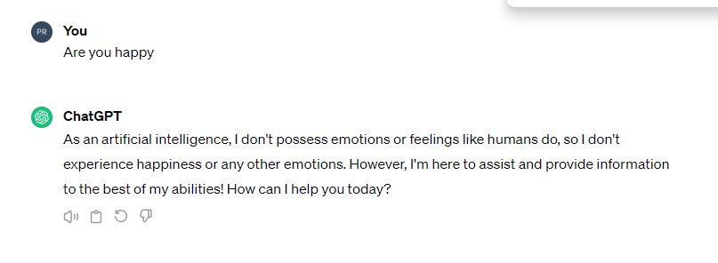

class: top, left
background-image:url('fig/1_stone.jpg')
background-position: 74% 50%
background-size: 180%


```{r setup, include=FALSE}
library(knitr)
options(htmltools.dir.version = FALSE)
opts_chunk$set(
  warning = FALSE,
  message = FALSE,
  echo = FALSE,
  cache.path = 'cache/',
  fig.align = 'center',
  cache = TRUE
)

library(tidyverse)
library(patchwork)
library(palmerpenguins)

```


```{css, echo=FALSE}
/* custom.css */
.left-code {
  color: #777;
  width: 70%;
  height: 92%;
  float: left;
}
.right-plot {
  width: 30%;
  float: right;
  padding-left: 1%;
}
.plot-callout {
  height: 225px;
  width: 450px;
  bottom: 5%;
  right: 5%;
  position: absolute;
  padding: 0px;
  z-index: 100;
}
.plot-callout img {
  width: 100%;
  border: 4px solid #23373B;
}
```


```{r xaringan-themer, include=FALSE, warning=FALSE}
library(xaringanthemer)
style_mono_accent(
   base_color = "#540317",
   title_slide_background_color = "#540317",
  inverse_background_color = "#540317",
  header_font_google = google_font("Josefin Sans"),
  text_font_google   = google_font("Montserrat", "300", "300i"),
  code_font_google   = google_font("Fira Mono"),
  title_slide_text_color = "#f5e9ec",
  inverse_header_color = "#f5e9ec",
  header_background_text_color = "#deced2",
   text_font_size = "1.4rem",
  inverse_text_color = "#f5e9ec"
  )
```


#### <span style="color:black">Senior Lecturer, Department of Computational Mathematics,  </br> University of Moratuwa </span>

--

#### <span style="color:black">PhD in Statistics, Monash University, Australia</span>


--

#### <span style="color:black">Associate Investigator of the Australian Research Council </br>  Centre  of Excellence for Mathematical and Statistical  </br> Frontiers (ACEMS), Australia</span>

--

#### <span style="color:black">Associate Editor, The R Journal (SJR ranking Q1)</span>

--


#### <span style="color:black">BSc (Hons) Special Degree  in Statistics, USJ - Batch first </br> Gold Medalist, 2012</span>

--


# <span style="color:#540317;background-color: #8ea9e8">Devi Balika Vidyalaya, Grade 6 -13</span>

---

class: top, middle
# Are you a human? 

```{r   out.width = "100%", echo = FALSE}

```

---

class: inverse, top, center
background-image:url('fig/dog_muffin.png')
background-color: black
background-position: 50% 80%
background-size: 80%


# Chihuahua and muffin

---


class: middle, center

# What is Human intelligence? 

--

## <span style="color:black">Multifaceted ability to learn, reason, adapt, and interact effectively, involving memory, language, logic, creativity, and emotion</span>

<!--. Human intelligence is highly complex and multifaceted, -->
---
class: middle, center

# What is Artificial intelligence (AI)? 

--

## <span style="color:black"> AI is technology that enables computers and </span> <span style="color:blue">machines to simulate human intelligence</span>,<span style="color:black">  such as speech recognition, decision-making, pattern identification, and problem-solving abilities.</span>

<!--AI enables machines to mimic human intelligence.-->


---
class: top, left, inverse
background-image:url('fig/Birth.png')
background-position: 50% 80%
background-size: 100%

---


# John McCarthy 

.pull-left[
```{r   out.width = "100%", echo = FALSE}
knitr::include_graphics("fig/john-mccarthy.png")
```
].pull-right[

## Coined the term <span style="color:red">Artificial Intelligence </span> in 1956 during the Dartmouth Conference, USA
]


<!--Image source:

"*Artificial intelligence is the science of making machines do things that would require intelligence if done by humans.*" https://home.dartmouth.edu/about/dartmouth-milestones-->


<!--
**Two-month research effort to explore the possibility of creating intelligent machines**-->

<!--which is considered the birth of AI as a field, the man who organized the conference where AI was born

1956. John McCarthy, Marvin Minsky, Nathaniel Rochester and Claude Shannon coined the term artificial intelligence in a proposal for a workshop widely recognized as a founding event in the AI field

held on the campus of Dartmouth College, USA 


John McCarthy did indeed coin the term "artificial intelligence" (AI) in 1956 during the Dartmouth Conference, where he proposed a two-month research effort to explore the possibility of creating intelligent machines-->

---
# John Tukey
.pull-left[


```{r   out.width = "80%", echo = FALSE}
knitr::include_graphics("fig/John_Tukey.jpg")
```
].pull-right[

## Coined the term <span style="color:red">bit</span> (1947) 

  *The most basic unit of information in computing and digital communications* 

## First published use of the word <span style="color:red">software </span> (1958)
]

<!--  most basic unit of information in computing and digital communications. -->
---

class: center, middle

background-image:url('fig/mytree.png')
background-position: 50% 80%
background-size: 70%
---
class: center, middle

background-image:url('fig/history.png')
background-position: 50% 80%
background-size: 55%

---

class:  center, middle


background-image:url('fig/applications.png')
background-position: 50% 90%
background-size: cover
---
class:  center, top


background-image:url('fig/pinnacle.png')
background-position: 80% 20%
background-size: 100%

# <span style="color:white">Are we nearing the pinnacle of AI?</span>
---
class: inverse, center, middle 
# The 7 Types of AI

#### Source: IBM, 2023
---

class: top, left
background-image:url('fig/AItypes1.png')
background-position: 50% 80%
background-size: cover


---
class: top, left
background-image:url('fig/AItypes2.png')
background-position: 50% 80%
background-size: cover


---
class: top, left
background-image:url('fig/AItypes3.png')
background-position: 50% 80%
background-size: cover


---
class: top, left
background-image:url('fig/AItypes4.png')
background-position: 50% 80%
background-size: cover


---
class: top, left
background-image:url('fig/AItypes5.png')
background-position: 50% 80%
background-size: cover


---
class: top, left
background-image:url('fig/AItypes6.png')
background-position: 50% 80%
background-size: cover


---
class: top, left
background-image:url('fig/AItypes7.png')
background-position: 50% 80%
background-size: cover


---
class: top, left
background-image:url('fig/AItypes8.png')
background-position: 50% 80%
background-size: cover


---
class: top, left
background-image:url('fig/AItypes9.png')
background-position: 50% 80%
background-size: cover


---

class: top, left
background-image:url('fig/NarrowAI.png')
background-position: 50% 80%
background-size: cover


---
class:  middle, center
# Narrow AI

## Artificial intelligence systems that are designed and trained for<span style="color:blue">  specific tasks or domains </span>.
---

class: top, left
background-image:url('fig/siri1.png')
background-position: 50% 80%
background-size: 100%
---
class: top, left
background-image:url('fig/NarrowAIeg.png')
background-position: 50% 50%
background-size: 100%

---

class: top, left
background-image:url('fig/chatgpt1.jpg')
background-position: 50% 80%
background-size: cover
---
class: bottom, center
background-image:url('fig/chatgpt.jpg')
background-position: 50% 80%
background-size: cover


### <span style="color:white">ChatGPT is considered Narrow AI because it is specialized in generating human-like text responses within a defined domain.</span>
---


class: top, left
background-image:url('fig/AGI.png')
background-position: 50% 80%
background-size: cover


---
class:  middle, center
# Strong AI 

### Artificial General Intelligence (AGI), General AI

## Has the ability to understand, learn, and apply knowledge across a <span style="color:blue"> wide range of tasks, similar to human intelligence </span>.

<!--
## AI systems that possess  <span style="color:blue">human-like cognitive abilities </span> to understand, learn, and perform tasks across diverse domains autonomously.
-->

<!--#### - Hypothetical future state of artificial intelligence

<!--
As of now, true examples of Artificial General Intelligence (AGI) do not exist

AGI represents a hypothetical future state of artificial intelligence where machines possess human-like cognitive abilities, such as reasoning, learning, and problem-solving, across a broad range of tasks and domains


In "A.I. Artificial Intelligence" (2001), the concept of General AI is explored through the character of David, a highly advanced robotic boy programmed to experience emotions and love. While the film primarily focuses on David's journey and his desire to become human, his capabilities and experiences offer glimpses into the concept of General AI.

David is designed to possess the ability to love and form emotional connections, which goes beyond the typical functions of AI seen in the film's world. He demonstrates the capacity to learn, adapt, and experience complex emotions such as longing, joy, and sorrow. Throughout the film, David's interactions with humans and other AI characters challenge the boundaries between artificial and human intelligence, raising questions about consciousness, identity, and the nature of humanity.-->
---
class: top, left
background-image:url('fig/strongai2.png')
background-position: 50% 50%
background-size: 100%
---
class: top, left
background-image:url('fig/disney2.png')
background-position: 50% 80%
background-size: cover


---

### ChatGPT

```{r   out.width= "150%", echo = FALSE}


```

---

class: top, left
background-image:url('fig/superAI.png')
background-position: 50% 80%
background-size: cover


---
class: middle, center
# Super AI

###  Artificial Superintelligence (ASI)


## Hypothetical level of artificial intelligence that <span style="color:blue">surpasses human intelligence </span> in virtually every aspect.

<!--


#### It goes beyond AGI by vastly exceeding human capabilities in problem-solving, creativity, learning, and strategic planning.


#### It is a subject of intense study and debate within the field of AI research.-->
---
class: top, left
background-color: black
<!--background-image:url('fig/matrix.png')-->
background-position: 50% 50%
background-size: 100%
---


class: top, left
background-image:url('fig/reactiveAI.png')
background-position: 50% 80%
background-size: cover
---
class: middle, center
# Reactive AI

## Operate based on <span style="color:blue">predefined rules </span> and lacks the ability to learn from experience 


<!-- **Operate based on predefined rules and direct input-output mappings.**

- **Respond to specific stimuli or inputs with predetermined actions.**


- **Lack the ability to learn from experience or adapt over time.**

 **These systems are well-suited for tasks with clear, deterministic rules and objectives.**-->
 
---
class: inverse
background-color: black
### Deep Blue: IBM's chess-playing computer defeated world chess champion Garry Kasparov in a six-game match in 1997


```{r   out.height= "70%", echo = FALSE}

knitr::include_graphics("fig/chess1.png")
```


<!--
- Relies on predefined rules and algorithms for evaluating board positions and selecting moves-->

---


class: top, left
background-image:url('fig/limitedmemory.png')
background-position: 50% 80%
background-size: cover
---
class: middle, center

# Limited Memory AI


## Uses a <span style="color:blue">small</span> amount of past data to make decisions.


<!--
Constrained ability to retain and recall past experiences or information.**


- **Relies on memory structures like short-term memory or caches for recent data.**


- **Decision-making based on recent experiences, not long-term learning.**

- **Used for real-time decision-making where data volume is large.**
-->
---

class: top, right
background-image:url('fig/vehicles.jpeg')
background-position: 50% 80%
background-size: 100%
### <span style="color:white;background-color: black">Autonomous Vehicles (Self-driving cars)</span>


<!--

- They rely on limited memory to navigate through traffic, obstacles, and changing road conditions.
- Use limited memory AI to process real-time sensor data, such as cameras and Light Detection and Ranging, to make driving decisions.
-->

---


class: top, right
background-image:url('fig/netflix2.png')
background-position: 50% 80%
background-size: 100%

### <span style="color:white;background-color: black">Recommendation Systems</span>


<!--Online platforms like Netflix and Amazon utilize limited memory AI to provide personalized recommendations to users. -->


---

class: top, left
background-image:url('fig/selfawareness.png')
background-position: 50% 80%
background-size: cover
---
class: middle, center
# Theory of Mind in Strong AI

## Aims to replicate human-like intelligence across various tasks by understanding <span style="color:blue">others' mental states</span> and intentions.


<!--
- Involves understanding others' mental states and intentions.**


- **Crucial for creating more human-like and versatile AI systems.**

-->

---
class: middle, center

# Self-awareness in Super AI

## A deeper understanding of <span style="color:blue">its own </span> internal processes, capabilities, and purpose.

<!--
- **Human self-awareness involves self-reflection and recognition of oneself as an individual separate from others.**


- **Self-awareness in Super AI may involve a deeper understanding of its own internal processes, capabilities, and purpose.**


- **This could enable the AI to reflect on its own thoughts and actions in ways that surpass human capacities.**

<!--, potentially leading to a more sophisticated level of consciousness.-->
---

class: top, left
background-image:url('fig/realizedai.png')
background-position: 50% 80%
background-size: cover
---
class: top, left
background-image:url('fig/boon.jpg')
background-position: 50% 80%
background-size: cover

---
class: bottom, center
background-image:url('fig/humanvalues.png')
background-position: 50% 80%
background-size: cover

## <span style="color: white; background-color: #370e96;">Risk to Humanity: ASI could endanger humanity if its goals don't match human values.</span>
---
class: bottom, center
background-image:url('fig/AIjobs.png')
background-position: 50% 0%
background-size: cover

## <span style="color: black; background-color: #bcbbbd;">Job Loss: ASI could replace humans in jobs, causing economic problems.</span>
---
class: inverse, bottom, center
background-image:url('fig/control.png')
background-color: black
background-position: 50% 10%
background-size: 100%

## <span style="color: white; background-color: black;">Loss of Control: Once ASI is smarter than us, we might not be able to control it.</span>

---
class: bottom, center
background-image:url('fig/weapon.jpg')
background-position: 50% 10%
background-size: 100%

## <span style="color: white; background-color: black;">Weaponization: ASI could be used for harm by bad people or countries.</span>


---

class: bottom, center
background-image:url('fig/bias.jpg')
background-position: 50% 10%
background-size: 90%

## <span style="color: black; background-color: white;">Bias and Discrimination: ASI might make unfair decisions based on biased data.</span>

---

class: bottom, center
background-image:url('fig/race.jpg')
background-position: 60% 10%
background-size: 110%

## <span style="color: black; background-color: #a8a8a8;"> Unpredictable Behavior: ASI may do things we can't predict because it's much smarter than humans.</span>

<!--
## Potential dangers of Artificial Superintelligence

- **Risk to Humanity: ASI could endanger humanity if its goals don't match human values.**


- **Unpredictable Behavior: ASI may do things we can't predict because it's much smarter than humans.**


- **Loss of Control: Once ASI is smarter than us, we might not be able to control it.**


- **Job Loss: ASI could replace humans in jobs, causing economic problems.**


- **Weaponization: ASI could be used for harm by bad people or countries.**


- **Bias and Discrimination: ASI might make unfair decisions based on biased data.**
-->
---
.pull-left[

```{r out.width= "80%", echo = FALSE}


```
].pull-right[

- Founder, CEO, and chief engineer of SpaceX

- CEO and product architect of Tesla, Inc.

- Owner of X (formerly Twitter)

- Founder of The Boring Company (infrastructure and tunnel construction company to alleviate traffic congestion in urban areas)

- Co-founder of Neuralink, OpenAI, Zip2, and X.com (part of PayPal)


]

<!--
Elon Musk has expressed concerns about the potential dangers of Artificial Superintelligence (ASI),

One of the richest peopke in the world

OpenAI is the organization behind the development of the GPT


In each of Elon Musk's companies, AI plays a role in various aspects of operations, research, and development:-->
---

class: top, left
background-image:url('fig/elonAGIbook.png')
background-position: 50% 50%
background-size: 100%


<!--

class: top, left, inverse
background-image:url('fig/elonASI1.png')
background-position: 50% 50%
background-size: 100%
-->

---
class: inverse, middle, center

.pull-left[

```{r   out.width = "65%", echo = FALSE}

```
].pull-right[

# </br></br></br></br> Those who are disciplined in mind are wise

]
---

class: inverse, middle, center

# Disciplined development and wise use of super AI are vital for its positive societal impact, highlighting the need for responsible tech advancement.

<!--
The statement "Those who are disciplined in mind are wise" aligns with the idea that disciplined development and wise utilization of super AI are essential for ensuring its beneficial impact on society, emphasizing the importance of thoughtful and responsible decision-making in advancing technology for a better world.-->
---
class: bottom, left, inverse
background-image:url('fig/responsibleai.jfif')
background-position: 50% 50%
background-size: 100%

## Ethical, fair, and accountable use of artificial intelligence.

<!--Responsible AI ensures ethical, fair, and accountable use of artificial intelligence."-->

---

class: right, middle, bottom
background-image:url('fig/aifuture.jfif')
background-position: 50% 80%
background-size: cover

# Charting the Path: A Beginner's Guide to AI Adventure!
---

## A Beginner's Guide to AI Adventure!

- **Foundational Learning: Focus on mathematics, computer science, and science subjects.**

--

- **Programming Proficiency: Learn programming languages like Python and practice coding regularly.**

--

- **Stay Updated: Keep updated with the latest AI developments through books, blogs, and events; join AI clubs, attend workshops, and participate in data competitions.**

--

- **Seek Mentorship: Find mentors or professionals in the AI field for guidance and support.**
--

- **Higher Education: Pursue studies in computer science or AI-related fields at a university.**


---
class: center, middle

# Calling all Tech Enthusiasts!

# University of Moratuwa

# Awaits You!

## `r icon::fa("github")` `r icon::fa("twitter")`pridiltal 


## `r icon::fa("globe")` prital.netlify.app

## Email: priyangad@uom.lk


<!--https://www.r-bloggers.com/2020/07/basic-data-analysis-with-palmerpenguins/ -->

<!--
### My research focuses on statistical machine learning, Time series analysis and forecasting and Computational statistics
-->
---
---

class:inverse, top, center
background-image:url('fig/labradoodle.jpg')
background-color: black
background-position: 50% 80%
background-size: 80%

# Labradoodle and fried chicken

---

class: inverse, center, middle

background-image:url('fig/alan.jpg')
background-position: 50% 80%
background-size: 100%
---

class: inverse, center, middle

background-image:url('fig/alanmovie.jfif')
background-position: 50% 80%
background-size: 75%
---
class: center, middle
# Turing Test (1950)

## A method to determine whether a machine can demonstrate human intelligence.

---
class:  center, top

background-image:url('fig/turingtestdiagram.jpg')
background-position: 50% 80%
background-size: 100%

---


class: center, middle

# AI winter 


## The times when interest and funding in AI decrease due to technology limitations or unmet expectations.

---

class: center, middle

background-image:url('fig/history.png')
background-position: 50% 80%
background-size: 55%

---